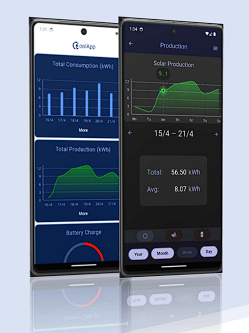

# CoolBox mobiiliprojekti App 
School team-project that tracks 
- power consumption
- power generated by windshunts, solarpanels and biodiesel generator
- microhouse (CoolBox) battery levels and temperatures

## Setup
- Clone with HTTPS
- Android studio: New -> Project from version control
  - Build gradle
  - Make sure [backend](https://github.com/theMsH/CoolBox-Mobile-App-backend) is running
  - Note: there is no dummy data, data used in this project came from a real world house via [mqqt](https://github.com/theMsH/CoolBox-Mobile-App-mqtt)
